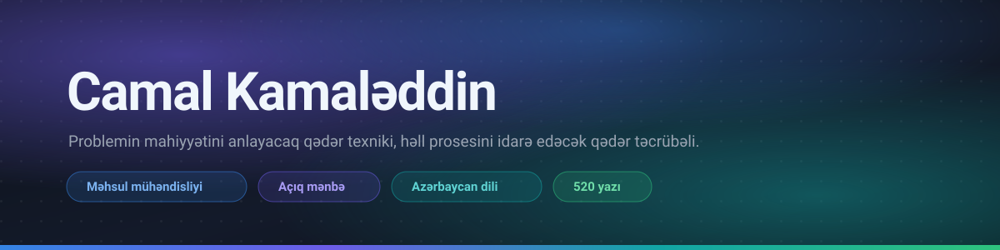

  

  
  
  
  
  
  

---

İşimin böyük hissəsi bizneslə sistemin ortasında keçir: əslində nə istənildiyini
müəyyən etmək, sonra mövcud məhdudiyyətlərin qəbul edəcəyi həlli tapmaq.

Maraqlı sual adətən «bunu necə yazaq?» deyil. Sual «bunu niyə belə qururuq?»
olur, və həmin seçimin bir ildən sonra nəyə başa gələcəyidir.

## Layihələr

### [pixelpact](https://github.com/jamalkamaladdin/pixelpact) &nbsp;

**Kod agenti indicə qurduğu səhifəni görmür.** pixelpact ona rəqəmlə danışan göz
verir: etalon səhifədən ölçülmüş müqavilə çıxarır, qurulan səhifəni onunla
yoxlayır və cavabı rəy kimi yox, ölçü, rəng, boşluq və vəziyyət kimi qaytarır.

Həm CLI, həm də MCP serveri kimi işləyir, yəni agent onu iş ortasında çağırıb
pozduğu yeri təhvil verməzdən əvvəl düzəldə bilir.

  
  
  
  
  
  

<table>
<tr>
<td width="50%" valign="top">

### [camalali-tools](https://github.com/jamalkamaladdin/camalali-tools)

Tam brauzerdə işləyən 166 developer aləti. JWT dekoderi, cron parser, regex
yoxlayıcısı, DNS və SSL sorğuları, CIDR hesablamaları, JSON və Base64 işləri.
Heç nə yüklənmir, çünki heç nə tabdan çıxmır.

  
  
  
  

</td>
<td width="50%" valign="top">

### [agent-ready-templates](https://github.com/jamalkamaladdin/agent-ready-templates)

Layihənin onsuz da yazmalı olduğu sənədlər, kod agentinin işləyə biləcəyi
formada. Hər şablon öz tapşırığını daşıyır: doldurulur, layihəyə uyğunlaşdırılır,
yoxsa onunla yoxlama aparılır.

  
  

</td>
</tr>
</table>

## Yazı

**[camalali.com](https://camalali.com)** saytında azərbaycanca yazıram, çünki bu
dildə bu dərinlikdə mühəndislik mətni demək olar ki yoxdur. 520 sistem dizaynı
yazısı, 1 000 terminlik texniki lüğət, rol üzrə yol xəritələri və yuxarıdakı
brauzer alətləri, canlı işləyən halda.

  
  
  
  

## Upstream layihələrdə Azərbaycan dili

  
  
  
  
  
  
  
  
  

## İstifadə etdiyim stack

  
  
  
  
  
  
  
  
  
  
  
  

## Əlaqə

[camalali.com](https://camalali.com) ·
[pixelpact.dev](https://pixelpact.dev) ·
[LinkedIn](https://www.linkedin.com/in/camalali/) ·
[ORCID 0009-0002-9513-0512](https://orcid.org/0009-0002-9513-0512) ·
[npm](https://www.npmjs.com/~jamalkamaladdin) ·
[English](README.md)
