

  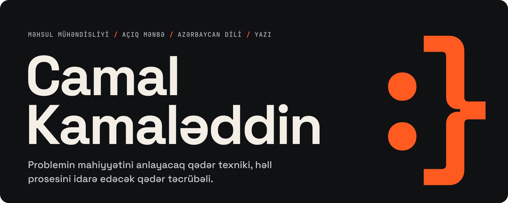

  
  
  
  
  
  

İşimin böyük hissəsi bizneslə sistemin ortasında keçir: əslində nə istənildiyini müəyyən etmək, sonra mövcud məhdudiyyətlərin qəbul edəcəyi həlli tapmaq.

Maraqlı sual adətən «bunu necə yazaq?» deyil. Sual «bunu niyə belə qururuq?» olur, və həmin seçimin bir ildən sonra nəyə başa gələcəyidir.

<picture>
  <source media="(prefers-color-scheme: dark)" srcset="assets/section/projects-az-dark.svg">
  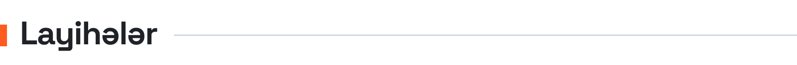
</picture>

<a href="https://github.com/jamalkamaladdin/pixelpact">
  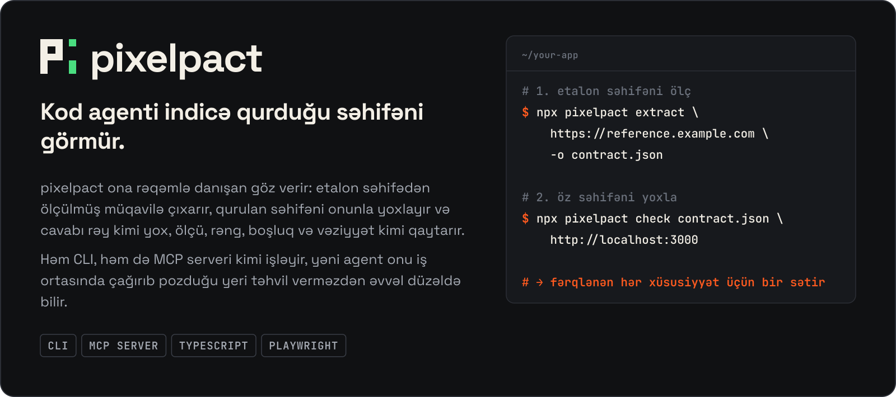
</a>

  
  
  
  

<a href="https://github.com/jamalkamaladdin/camalali-tools">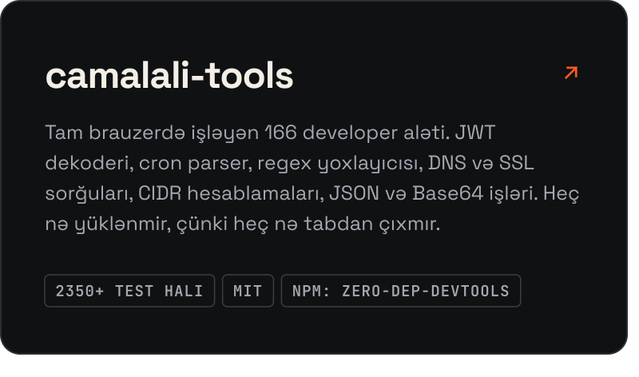</a><a href="https://github.com/jamalkamaladdin/agent-ready-templates">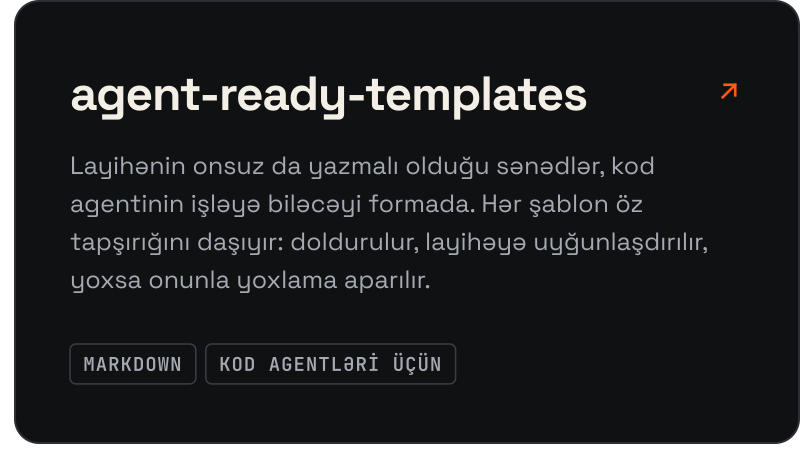</a>

<picture>
  <source media="(prefers-color-scheme: dark)" srcset="assets/section/writing-az-dark.svg">
  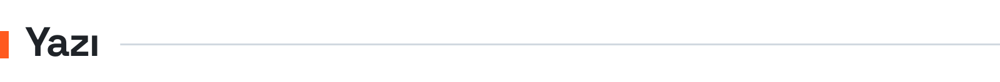
</picture>

**[camalali.com](https://camalali.com)** saytında azərbaycanca yazıram, çünki bu dildə bu dərinlikdə mühəndislik mətni demək olar ki yoxdur. 520 sistem dizaynı yazısı, 1 000 terminlik texniki lüğət, rol üzrə yol xəritələri və yuxarıdakı brauzer alətləri, canlı işləyən halda.

  <a href="https://camalali.com/bloq">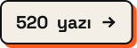</a>
  <a href="https://camalali.com/luget">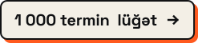</a>
  <a href="https://camalali.com/alet">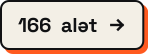</a>
  <a href="https://camalali.com/sablonlar">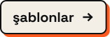</a>

<picture>
  <source media="(prefers-color-scheme: dark)" srcset="assets/section/az-az-dark.svg">
  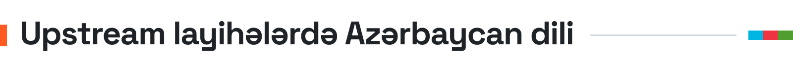
</picture>

Açıq mənbə proqramlara Azərbaycan dilini əlavə edirəm, hər dəfə bir pull request ilə. Aşağıda ən çox ulduzu olan on layihə var, qəbul olunmuş bütün tərcümələr tam siyahıdadır.

<!-- az-locale:start -->
<a href="https://github.com/jamalkamaladdin/azerbaijani-translations">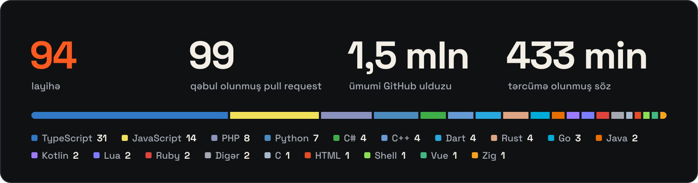</a>

<a href="https://github.com/NginxProxyManager/nginx-proxy-manager/pull/5837">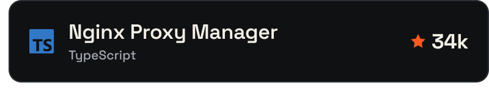</a>

<!-- az-locale:end -->

  

<picture>
  <source media="(prefers-color-scheme: dark)" srcset="assets/section/stack-az-dark.svg">
  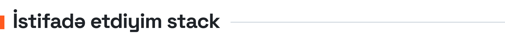
</picture>

  
  
  
  
  
  

