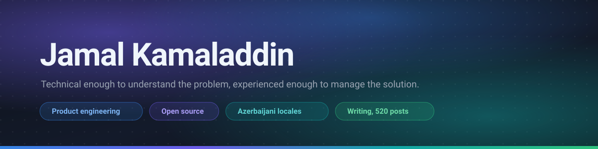

  

  
  
  
  
  
  

---

Most of what I do sits between the business and the system: working out what is
actually being asked for, then finding the answer the existing constraints will
tolerate.

The interesting question is usually not *how do we build this*. It is *why are
we building it this way*, and what that choice will cost in a year.

## Projects

### [pixelpact](https://github.com/jamalkamaladdin/pixelpact) &nbsp;

**Your coding agent cannot see the page it just built.** pixelpact gives it eyes
that report numbers. It extracts a measured contract from the reference page,
checks the implementation against it, and answers with sizes, colours, spacing
and states rather than an opinion.

It runs as a CLI and as an MCP server, so the agent can call it mid-task and fix
what it broke before handing the work over.

  
  
  
  
  
  

<table>
<tr>
<td width="50%" valign="top">

### [camalali-tools](https://github.com/jamalkamaladdin/camalali-tools)

166 developer tools that work entirely in the browser. JWT decoder, cron parser,
regex tester, DNS and SSL lookups, CIDR maths, JSON and Base64 work. Nothing is
uploaded, because nothing leaves the tab.

  
  
  
  

</td>
<td width="50%" valign="top">

### [agent-ready-templates](https://github.com/jamalkamaladdin/agent-ready-templates)

The documents a project has to produce anyway, packaged so a coding agent can
act on them. Each template carries the instruction that says which job it is:
fill it in, adapt it to the repository, or audit a project against it.

  
  

</td>
</tr>
</table>

## Writing

I write in Azerbaijani at **[camalali.com](https://camalali.com)**, because the
language has almost no engineering writing at this depth. 520 long-form articles
on system design, a 1,000 term technical glossary, role by role learning paths,
and the browser tools above running live.

  
  
  
  

## Azerbaijani in upstream projects

<!-- az-locale:start -->

  
  
  
  
  
  
  
  
  
  
  
  
  

<a href="https://github.com/jamalkamaladdin/azerbaijani-translations">Full list</a>

<!-- az-locale:end -->

## Things I code with

  
  
  
  
  
  
  
  
  
  
  
  
  
  
  
  
  
  
  
  
  
  
  
  
  
  
  
  
  
  
  
  
  
  
  
  
  
  
  
  
  
  
  

## Elsewhere

[camalali.com](https://camalali.com) ·
[pixelpact.dev](https://pixelpact.dev) ·
[LinkedIn](https://www.linkedin.com/in/camalali/) ·
[ORCID 0009-0002-9513-0512](https://orcid.org/0009-0002-9513-0512) ·
[npm](https://www.npmjs.com/~jamalkamaladdin) ·
[Azərbaycanca](README.az.md)
