

  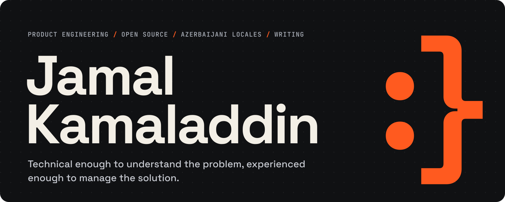

  
  
  
  
  
  

Most of what I do sits between the business and the system: working out what is actually being asked for, then finding the answer the existing constraints will tolerate.

The interesting question is usually not *how do we build this*. It is *why are we building it this way*, and what that choice will cost in a year.

<picture>
  <source media="(prefers-color-scheme: dark)" srcset="assets/section/projects-en-dark.svg">
  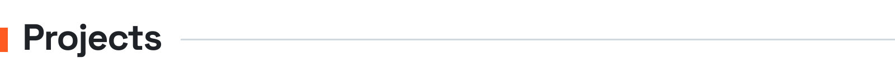
</picture>

<a href="https://github.com/jamalkamaladdin/pixelpact">
  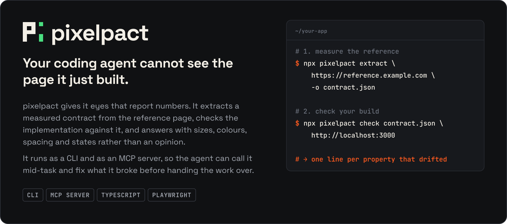
</a>

  
  
  
  

<a href="https://github.com/jamalkamaladdin/camalali-tools">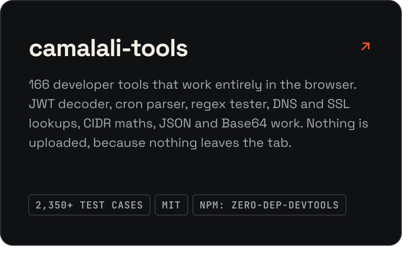</a><a href="https://github.com/jamalkamaladdin/agent-ready-templates">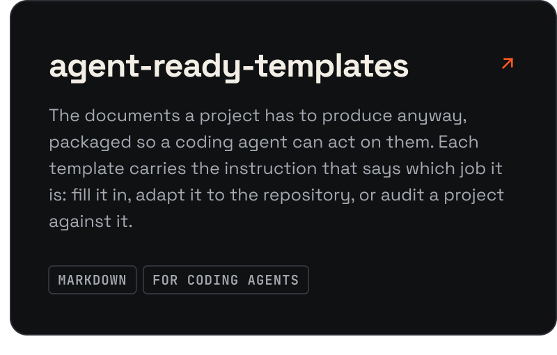</a>

<picture>
  <source media="(prefers-color-scheme: dark)" srcset="assets/section/writing-en-dark.svg">
  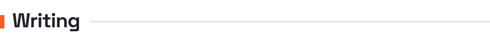
</picture>

I write in Azerbaijani at **[camalali.com](https://camalali.com)**, because the language has almost no engineering writing at this depth. 520 long-form articles on system design, a 1,000 term technical glossary, role by role learning paths, and the browser tools above running live.

  <a href="https://camalali.com/bloq">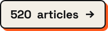</a>
  
  <a href="https://camalali.com/alet">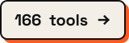</a>
  <a href="https://camalali.com/sablonlar">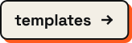</a>

<picture>
  <source media="(prefers-color-scheme: dark)" srcset="assets/section/az-en-dark.svg">
  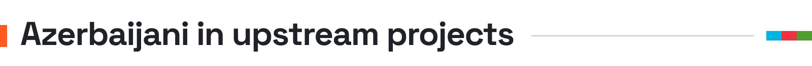
</picture>

I add Azerbaijani to open source software, one pull request at a time. Below are the ten most-starred projects; the full list has every merged translation.

<!-- az-locale:start -->
<a href="https://github.com/jamalkamaladdin/azerbaijani-translations">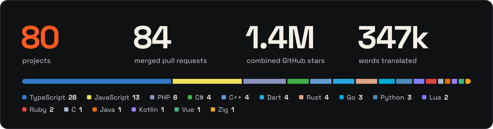</a>

<a href="https://github.com/langgenius/dify/pull/42291">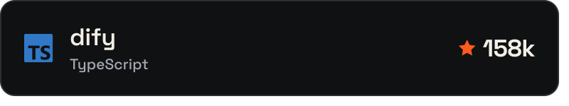</a><a href="https://github.com/clash-verge-rev/clash-verge-rev/pull/7906">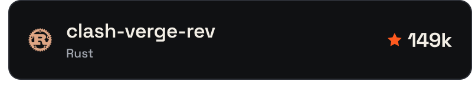</a>
<a href="https://github.com/harry0703/MoneyPrinterTurbo/pull/1339">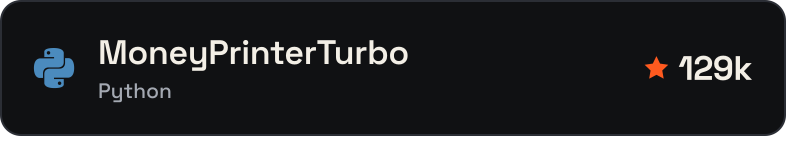</a><a href="https://github.com/rustdesk/rustdesk/pull/16103">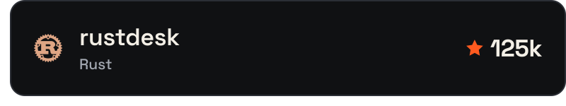</a>
<a href="https://github.com/2dust/v2rayN/pull/10141">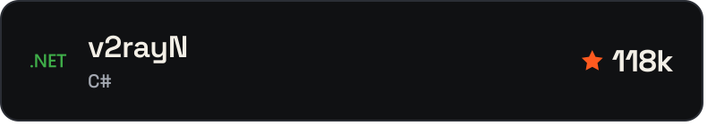</a><a href="https://github.com/neovim/neovim/pull/41816">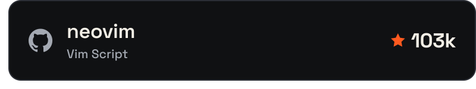</a>
<a href="https://github.com/infiniflow/ragflow/pull/20131">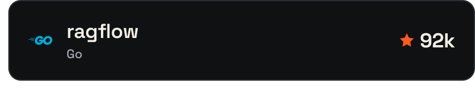</a><a href="https://github.com/usememos/memos/pull/6278">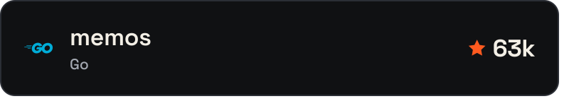</a>
<a href="https://github.com/TryGhost/Ghost/pull/30528">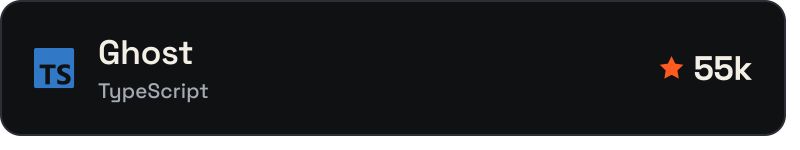</a><a href="https://github.com/umami-software/umami/pull/4520">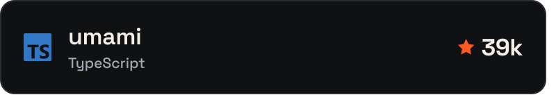</a>

<!-- az-locale:end -->

  

<picture>
  <source media="(prefers-color-scheme: dark)" srcset="assets/section/stack-en-dark.svg">
  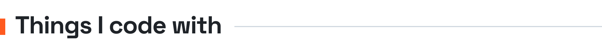
</picture>

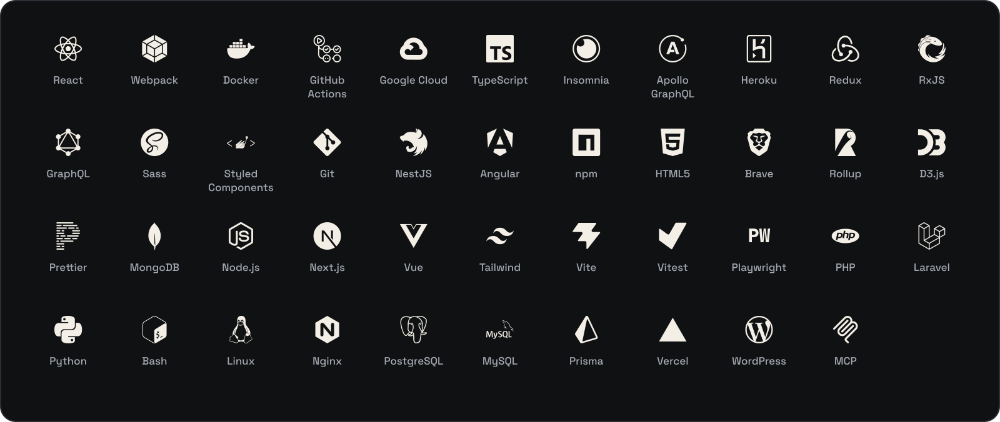

  
  
  
  
  
  

